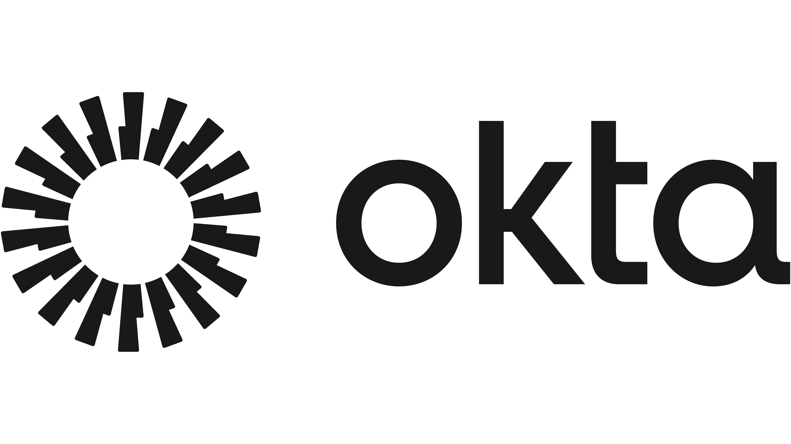
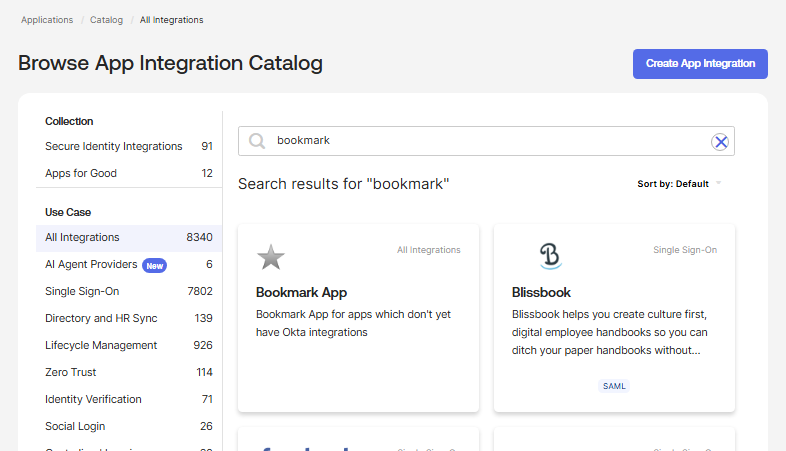
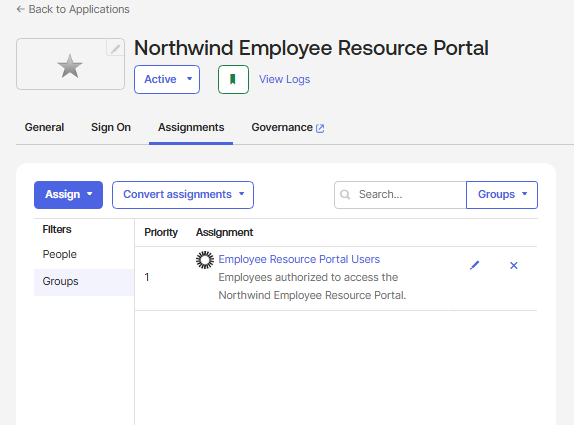
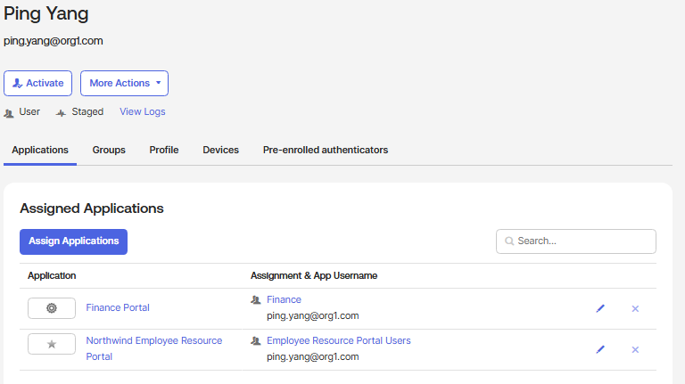
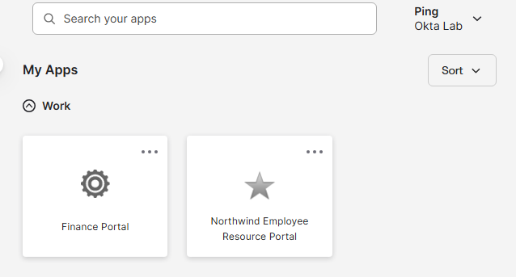
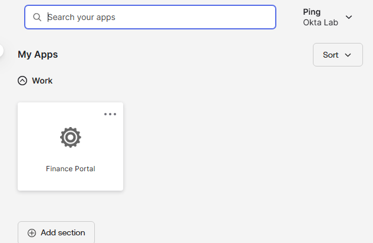
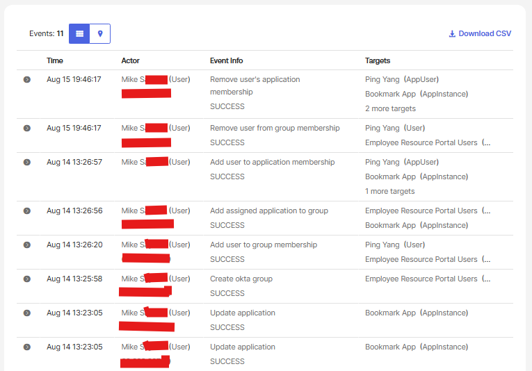

<h1>Okta Integration Network (OIN) Application Deployment and Access Management</h1>

In this lab, we used the Okta Integration Network (OIN) App Catalog to deploy a prebuilt application integration and manage access through group-based assignments. We created a dedicated application access group, assigned the application to the group, validated inherited application access from the end-user dashboard, removed a user from the access group, and verified that the application entitlement was automatically removed. The Okta System Log was then reviewed to validate the complete application access lifecycle and audit trail. This lab demonstrates practical OIN application deployment, group-based access management, application entitlement management, and IAM auditing.  

<h2>Environments and Technologies Used</h2>

- Okta Identity Cloud
- Okta Integration Network (OIN)
- Okta App Integration Catalog
- Okta Universal Directory
- Okta Groups
- Group-Based Application Assignment
- Application Entitlement Management
- Okta End-User Dashboard
- Okta System Log

<h2>High-Level Steps</h2>

- Step 1. Deploy an Application from the Okta Integration Network
- Step 2. Configure Group-Based Application Access
- Step 3. Validate Inherited Application Entitlement
- Step 4. Validate Application Access from the End-User Dashboard
- Step 5. Remove Group Membership and Validate Access Removal
- Step 6. Review the Application Access Lifecycle in the System Log

> [!IMPORTANT]
> Application access was managed through group membership rather than direct user assignment. Users added to the access group inherited the application entitlement, while removing a user from the group removed the inherited application access.

<h2>Actions and Observations</h2>

<b>1. DEPLOY APPLICATION FROM THE OKTA INTEGRATION NETWORK</b>

Opened the Okta App Integration Catalog and searched for the prebuilt **Bookmark App** integration.

The Bookmark App was added to the Okta organization and configured as the **Northwind Employee Resource Portal**.

Using an existing catalog integration demonstrates how administrators can deploy prepared application integrations without creating every application integration manually.

See screenshot

<b>2. CONFIGURE GROUP-BASED APPLICATION ACCESS</b>

Created an Okta group named **Employee Resource Portal Users** to manage access to the Northwind Employee Resource Portal.

The **Employee Resource Portal Users** group was assigned directly to the application.

This established a group-based entitlement model:

`User → Employee Resource Portal Users → Northwind Employee Resource Portal`

Users who are members of the group inherit access to the application without requiring individual application assignments.

See screenshot

> [!NOTE]
> Group-based application assignments simplify access administration because application access can be controlled by managing group membership rather than maintaining individual application assignments.

<b>3. VALIDATE INHERITED APPLICATION ENTITLEMENT</b>

Ping Yang was added to the **Employee Resource Portal Users** group.

Reviewed Ping Yang's assigned applications and verified that **Northwind Employee Resource Portal** was inherited through the Employee Resource Portal Users group.

Ping also retained her existing Finance Portal entitlement, demonstrating that multiple application entitlements can be inherited from different access groups.

See screenshot

<b>4. VALIDATE END-USER APPLICATION ACCESS</b>

Signed in to the Okta End-User Dashboard as Ping Yang.

The **Northwind Employee Resource Portal** appeared alongside Ping's existing Finance Portal application.

This confirmed that the group-based application assignment successfully provided the application entitlement to the end user.

See screenshot

<b>5. REMOVE GROUP MEMBERSHIP AND VALIDATE ACCESS REMOVAL</b>

Removed Ping Yang from the **Employee Resource Portal Users** group.

After the group membership was removed, Ping no longer inherited the Northwind Employee Resource Portal application assignment.

Signed back into Ping Yang's End-User Dashboard and confirmed that the **Northwind Employee Resource Portal** was no longer available while the unrelated Finance Portal remained accessible.

See screenshot

> [!IMPORTANT]
> Removing Ping from the application access group removed only the entitlement associated with that group. Her unrelated Finance Portal access remained available, demonstrating targeted access removal rather than disabling all application access.

<b>6. REVIEW APPLICATION ACCESS LIFECYCLE IN SYSTEM LOG</b>

Reviewed the Okta System Log to validate the administrative and application-access events generated during the lab.

The audit trail recorded successful events including:

- Creation of the Employee Resource Portal Users group
- Addition of Ping Yang to the group
- Assignment of the Bookmark App to the group
- Addition of Ping Yang to application membership
- Removal of Ping Yang from group membership
- Removal of Ping Yang's application membership

The System Log provided an auditable record connecting the group membership changes to the resulting application entitlement changes.

See screenshot

> [!NOTE]
> Reviewing the System Log allowed us to verify both the administrative access changes and the resulting application membership changes, providing an audit trail of the complete access lifecycle.

<h2>Skills Demonstrated</h2>

- Okta Integration Network (OIN)
- Okta App Integration Catalog
- Enterprise Application Integration
- Group-Based Access Management
- Application Assignment
- Application Entitlement Management
- Okta Universal Directory
- Access Provisioning and Removal
- Identity Lifecycle Management
- Least Privilege
- Okta End-User Dashboard
- Okta System Log
- IAM Auditing
- Access Validation
- Identity and Access Management (IAM)
